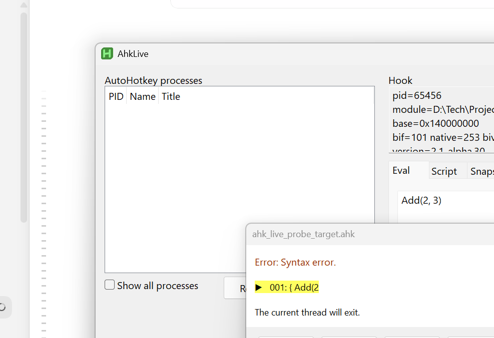
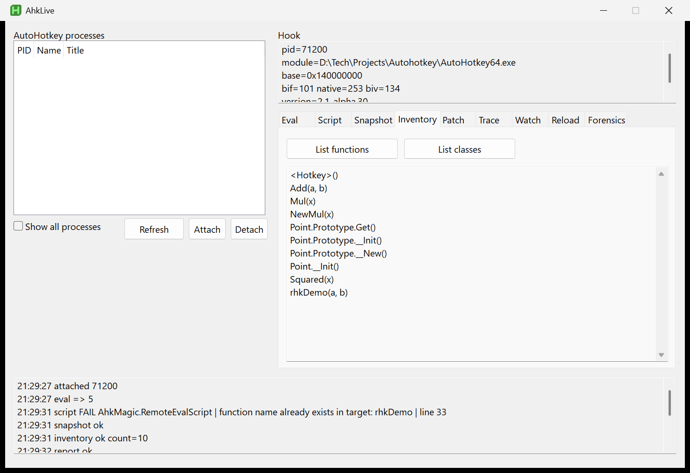
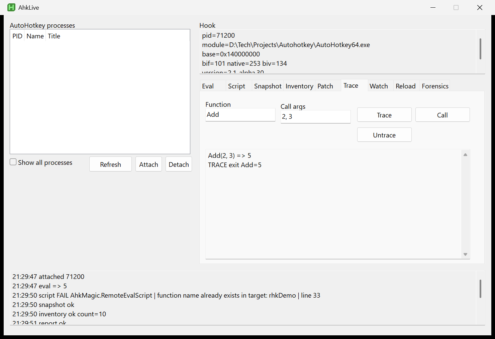
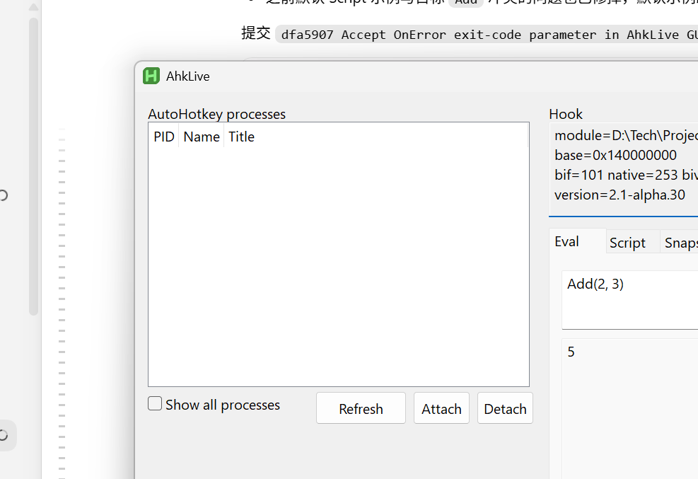

# ahk-hack


Runtime introspection for AutoHotkey v2 executables. The library scans a running
`AutoHotkey64.exe`, locates interpreter structures, evaluates expressions
through the interpreter's own parser, loads scripts from memory, attaches to
other AutoHotkey processes, and provides a live product layer on top of those
primitives.

Repository: [https://github.com/MonoEven/ahk-hack-library](https://github.com/MonoEven/ahk-hack-library)

Technical pages: [https://monoeven.github.io/ahk-hack-library/](https://monoeven.github.io/ahk-hack-library/)

Practice integration: [https://github.com/MonoEven/cnumpy](https://github.com/MonoEven/cnumpy)

## Contents

- [What it does](#what-it-does)
- [Quick start](#quick-start)
- [Architecture](#architecture)
- [Dynamic layout discovery](#dynamic-layout-discovery)
- [Remote hooking](#remote-hooking)
- [AhkLive](#ahklive)
- [Verification](#verification)
- [Blog and Pages](#blog-and-pages)
- [Security](#security)
- [Project layout](#project-layout)
- [Building from source](#building-from-source)
- [Testing](#testing)
- [License](#license)

## What it does

The core is one file: `ahk_hack_single.ahk`. It contains `MCode()`, `AhkMagic`,
all embedded x64 machine-code blobs, dynamic layout scanners, and remote
primitives.

Main capabilities:

- Runtime PE parsing and interpreter table discovery.
- Generic PE export scanning for any loaded module.
- Built-in function redirection at table and object level.
- In-process expression evaluation through `ExpressionToPostfix` and
  `ExpandExpression`.
- In-memory script loading through `LoadIncludedFile(TextStream*)`.
- Remote attach, remote eval, remote script loading, and function body
  replacement.
- Live function tracing based on `UserFunc` cloning.
- `lib/ahk_live/`: sessions, inventory, watch, hot reload, observability, fault
  injection, CLI, MCP, and GUI.

## Quick start

### Core scanning

```ahk
#Include ahk_hack_single.ahk

AhkMagic.Init()
MsgBox AhkMagic.Summary()

absRva  := AhkMagic.BifRva("Abs")
absAddr := AhkMagic.BifAddr("Abs")
```

### Export scanning

```ahk
hmod := DllCall("LoadLibraryW", "Str", "D:\path\module.dll", "Ptr")
exports := AhkMagic.ScanExports(hmod)
MsgBox exports.Count
```

### Built-in redirection

```ahk
old := AhkMagic.PatchBif("Abs", "Sin")
name := "Abs"
MsgBox %name%(1)              ; dynamic lookup returns sin(1)
AhkMagic.RestoreBif("Abs", old)

state := AhkMagic.PatchBifObject(Abs, "Sin")
MsgBox Abs(1)                 ; direct call returns sin(1)
AhkMagic.RestoreBifObject(Abs, state)
```

### In-process Eval

```ahk
MsgBox AhkMagic.EvalNative("1 + 2 * 3")           ; 7
MsgBox AhkMagic.EvalNative("Abs(-5)")             ; 5
MsgBox AhkMagic.EvalNative("Point(1, 2).y")       ; 2, class loaded in-process
```

### EvalScript

```ahk
text := "
(
add(a, b) {
    return a + b
}
add(1, 2)
)"
MsgBox AhkMagic.EvalScript(text)                   ; 3

cls := "
(
class Point {
    x := 0
    y := 0
    __New(x, y) {
        this.x := x
        this.y := y
    }
}
Point(1, 2).y
)"
MsgBox AhkMagic.EvalScript(cls)                    ; 2
```

### Remote hook

```ahk
hook := AhkMagic.AttachRemote(pid)
MsgBox AhkMagic.RemoteEval(hook, "1 + 2 * 3")      ; 7

script := "
(
rhkAdd(a, b) {
    return a + b
}
rhkAdd(1, 2)
)"
MsgBox AhkMagic.RemoteEvalScript(hook, script)     ; 3

AhkMagic.RemoteReplaceFuncBody(hook, "A", "NewA")
```

## Architecture

### PE parsing and table discovery

The scanner parses the DOS header, PE headers, and section table. It classifies
`.text`, `.rdata`, and `.data`, then validates candidate records without an RVA
table:

- the name pointer resolves to UTF-16 text;
- the function pointer lands in executable code;
- neighboring records are sorted by name;
- known anchors such as `Abs`, `BlockInput`, and `AhkPath` are present.

The table record strides on x64 are `0x20` for `g_BIF`, `0x28` for `sMdFunc`,
and `0x18` for `g_BIV_A`.

### Machine-code build

The stable scanner is written in C under `lib/mcode/`. The build uses clang to
produce freestanding, position-independent COFF objects:

```powershell
clang -c -O2 -target x86_64-pc-windows-msvc -ffreestanding `
  -fno-builtin -fno-stack-protector -fno-unwind-tables `
  -fno-asynchronous-unwind-tables -fno-jump-tables scanner.c
```

`tools/build_mcode.py` extracts `.text`, decodes relocations, and rejects any
blob with a relocation that escapes the blob. The resulting hex string is
embedded in `ahk_hack_single.ahk`.

### Expression evaluation

AutoHotkey compiles expression strings into postfix `ExprTokenType` arrays.
`EvalNative()` builds a temporary `Line` and `ArgStruct`, then calls the
interpreter's own `ExpressionToPostfix` and `ExpandExpression`.

`EvalScript()` feeds multi-line text through `LoadIncludedFile(TextStream*)`
from an in-memory `TextStream`. No temporary file is created.

## Dynamic layout discovery

The library does not maintain a per-version offset table. The following items
are discovered from the live module or process:

- PE section map and interpreter table addresses;
- `ExpressionToPostfix`, `ExpandExpression`, `FindOrAddVar`, `gScript`, and
  `g`;
- `mFuncs`, `mFuncsCount`, function name field, and `mJumpToLine`;
- parser-state anchors inside `LoadIncludedFile`;
- `Line`, `ArgStruct`, `ExprTokenType`, and `DerefType` field offsets;
- `SYM_INVALID` and related locator outputs.

The exact audit is in [docs/hardcoded-audit.md](docs/hardcoded-audit.md).

## Remote hooking

`AttachRemote(pid)` opens a target process, reads its PE image and interpreter
tables, and returns a hook. `RemoteEval()` injects a locator/evaluator thread.
`RemoteEvalScript()` loads script text through the target's own parser.
`RemoteReplaceFuncBody()` swaps `mJumpToLine` so existing callers execute a new
body.

Hotkey verification:

```ahk
hook := AhkMagic.AttachRemote(pid)
AhkMagic.RemoteEvalScript(hook, "
(
NewA() {
    return 42
}
NewA()
)")
AhkMagic.RemoteReplaceFuncBody(hook, "A", "NewA")
Send("{F9}")
```

The target writes `A()=42` after the original output was `A()=1`.

## AhkLive

`lib/ahk_live/` builds a stable API on the remote primitives.

```ahk
#Include lib\ahk_live\init.ahk

session := AhkLiveSession()
if !session.Attach(pid).ok
    throw Error("attach failed")

snap := session.Snapshot(Map(
    "add", "Add(2, 3)",
    "mul", "Mul(4)"
))

patch := session.BeginPatch()
ps := patch.value
ps.Replace("Mul", "NewMul")
ps.Rollback()

session.Close()
```

AhkLive includes:

- `Attach`, `Eval`, `EvalScript`, `Snapshot`, `Globals`;
- `ListFunctions`, `ListClasses`;
- `ReplaceFunction`, `RestoreFunction`, `TraceFunction`, `Untrace`;
- `Watch`, `HotReload`;
- `AhkLiveJournal`, `AhkLiveSession`, `AhkLivePatchSession`;
- `AhkLiveAgent`, `AhkLiveObservability`, `AhkLiveFault`;
- `AhkLiveDesktop`, `AhkLiveForensics`, `AhkLiveCompat`;
- `ahk_live_cli.ahk`, `tools/ahk_live_mcp.py`, `ahk_live_gui.ahk`.

`TraceFunction` clones the target `UserFunc`, creates a `VAR_CONSTANT` alias,
injects a wrapper, aliases the wrapper's parameter `Var` objects to the
original parameters, and swaps `mJumpToLine`. This keeps `mFuncs` and
`VarList` sorted across repeated script injections.

## Verification

`tools/verify_all_runtimes.ps1` runs a nine-test matrix against every
AutoHotkey runtime found on this machine. Current coverage:

- `2.0-beta.9/10/12/13/15`
- `2.0-rc.1/3`
- `2.0.0/2/3/4/26`
- `2.1-alpha.1/4/13/16/30`
- two local `2.0-beta` dev builds

All 19 runtimes pass all 9 tests. The latest report is
[reports/runtime_matrix_all.txt](reports/runtime_matrix_all.txt).

## Screenshots

The AhkLive GUI can attach to a running AutoHotkey process, evaluate
expressions, load scripts, inspect inventory, patch functions, trace calls,
watch values, and export runtime reports.










## Blog and Pages

The repository separates the blog from the technical Pages site.

- Blog: practical examples; the appendix links to the repository raw file
  and the Pages appendix (the full source is no longer embedded so the
  post stays under forum length limits).
  - `blog_ahk_hack_en.txt`
  - `blog_ahk_hack.txt`
  - Built by `tools/build_blog.py`.
- Separate post: AhkLive GUI screenshot walkthrough.
  - `blog_ahk_live_gui_en.txt`
  - `blog_ahk_live_gui.txt`
- Pages: analysis and extraction workflow.
  - `docs/pages_en.txt`
  - `docs/pages_zh.txt`
  - Generated by `tools/build_site.py`.

## Failure behavior

The library treats its own inputs and the target's memory as untrusted and
fails explicitly:

- `Init()`/`ScanExports()` cap record counts against the scanner contract and
  memory-map-check every name pointer; unsupported layouts throw instead of
  reading out of bounds.
- `EvalScript()`/`RemoteEvalScript()` pre-check the text with the
  interpreter's own `/validate` switch (the target's executable for the remote
  path), so a syntax error throws a clean library error carrying the real
  parse message instead of aborting the host or target. The validator runs
  hidden with `/ErrorStdOut`, captures all output to a file, and kills its
  whole process tree within six seconds if any build hangs on a dialog, so
  errors never pop up on screen.
- The in-memory `TextStream` is populated at both known `mData` slots
  (2.0: `0x40`, 2.1: `0x50`) so no version choice is made; every load is
  validated by its result (`rc == 1` plus a function-count increase for the
  discovery probe), so an unsupported layout fails loudly at probe time
  instead of misparsing text.
- A hung remote evaluation times out after 10 seconds, throws, and
  deliberately leaks its injected block (up to 8 MiB per timeout) because
  freeing memory the target is still executing would corrupt it.
- `EvalNative()` returns live `Func`/`Class` objects for object results;
  `RemoteEval()` returns the object's address in the target as an integer.
- `RemoteEvalScript()` injects randomized probe functions and retries layout
  discovery when the target has no user functions.
- `PatchBifObject()` and `RemoteDeepRedirect()` commit atomically with
  rollback; layout probes restore their interpreter snapshot in `finally`.

## Security

This library allocates executable memory, executes machine code, and writes
interpreter memory. It does not provide sandbox isolation.

Rules:

- attach only to processes you own;
- use disposable targets for repeated experiments;
- restore patches in `finally` or through `AhkLivePatchSession.Rollback()`;
- never eval untrusted input;
- treat locator failures as errors.

## Project layout

```text
ahk_hack_single.ahk        single-file core
ahk_hack_demo.ahk          runnable demo
ahk_live_gui.ahk           GUI for live inspection
blog_ahk_hack_en.txt       English blog with embedded single-file source
blog_ahk_hack.txt          Chinese blog with embedded single-file source
docs/
  pages_en.txt             English Pages source
  pages_zh.txt             Chinese Pages source
  index.html               generated English Pages
  index.zh.html            generated Chinese Pages
  images/                  screenshots and visual assets
lib/
  init.ahk                 core entry
  ahk_hack.ahk             MCode() + AhkMagic
  ahk_live/                product layer
  mcode/                   machine-code C sources
  cnumpy/                  optional cnumpy integration
tools/
  build_mcode.py           builds and embeds machine code
  build_site.py            generates Pages
  build_blog.py            embeds single-file source into blog
  verify_all_runtimes.ps1  full runtime matrix
  ahk_live_mcp.py          MCP server
tests/                     core, eval, remote, AhkLive tests
reports/                   runtime matrix reports
```

## Building from source

The embedded machine code can be regenerated with:

```powershell
python tools\build_mcode.py --embed-only --out ahk_hack_single.ahk
```

After rebuilding, regenerate the blog and Pages:

```powershell
python tools\build_blog.py
python tools\build_site.py
```

## Testing

Run the in-process probes:

```powershell
AutoHotkey64.exe tests\evalscript_inproc.ahk
AutoHotkey64.exe tests\evalscript_repeat.ahk
AutoHotkey64.exe tests\evalscript_class.ahk
```

Run the remote and AhkLive matrix:

```powershell
powershell -ExecutionPolicy Bypass -File tools\verify_all_runtimes.ps1
```

## License

MIT
